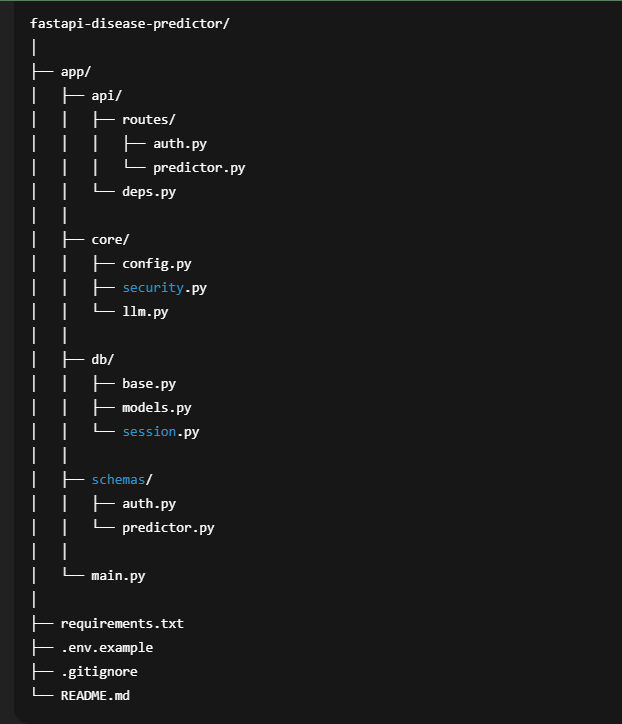
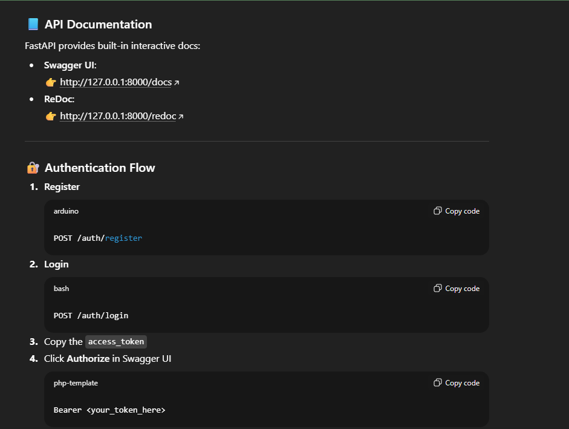

# 🧠 AI Disease Predictor (FastAPI + PostgreSQL)

A secure, non-diagnostic AI-powered disease prediction API built using FastAPI, PostgreSQL, and JWT authentication.
The system predicts possible diseases based on user-provided symptoms while handling invalid or meaningless inputs safely.

⚠️ Disclaimer: This application does not provide medical diagnoses. It is for educational purposes only.

## 🌐 Live Demo
#### Backend URL  : [Backend Demo](https://fastapi-disease-predictor.onrender.com/docs)

## 📂 Project Structure


## 🚀 Features

  - 🔐 User Authentication

  - Register & login

  - JWT-based authentication (Bearer tokens)

  - 🧠 Disease Prediction API

  - Accepts symptoms as text

  - Validates input (rejects gibberish like hdhshd or 12345)

  - Uses LLM (or mock mode when quota is unavailable)

  - Returns 1–3 possible conditions with a disclaimer

  - 🗄️ PostgreSQL Database

  - Stores users securely (hashed passwords)

  - Stores prediction history per user

  - ⚙️ Async & Scalable

  - Async SQLAlchemy

  - Async FastAPI endpoints

## 🧱 Tech Stack

  - Backend: FastAPI

  - Database: PostgreSQL

  - ORM: SQLAlchemy (Async)

  - Auth: JWT (python-jose)

  - Security: Argon2 password hashing

  - AI: OpenAI (optional) / Mock LLM

  - Language: Python 3.10+


Check:
```bash
python --version
```

## ⚙️ Installation & Setup
### 1️⃣ Clone the repository
```bash
git clone https://github.com/gopichandu-tech/fastapi-disease-predictor.git
cd fastapi-disease-predictor
```

### 2️⃣ Create virtual environment
```bash
python -m venv venv
source venv/bin/activate   # Linux / Mac
venv\Scripts\activate      # Windows
```

### 3️⃣ Install dependencies
```bash
pip install -r requirements.txt
```

### ▶️ Running the Server
Development
```bash
uvicorn app.main:app --reload
```

### Production
```bash
uvicorn app.main:app --host 0.0.0.0 --port 10000
```




### 📡 API Endpoint
```bash
POST /predict
Authorization: Bearer <token>

Request

{
  "user_name": "John Doe",
  "email": "john@example.com",
  "symptoms": "fever, headache, sore throat"
}
```

```bash
Response

{
  "prediction": "Based on the provided symptoms, possible conditions include Seasonal Flu and Common Cold. This is not a medical diagnosis."
}

```


```bash
Example of Invalid Input

{
  "symptoms": "hdhdhshsjs"
}

{
  "prediction": "Invalid input detected. Please describe real symptoms using meaningful medical terms."
}


```

## 👨‍💻 Author

#### Gopichandu
#### GitHub: https://github.com/gopichandu-tech